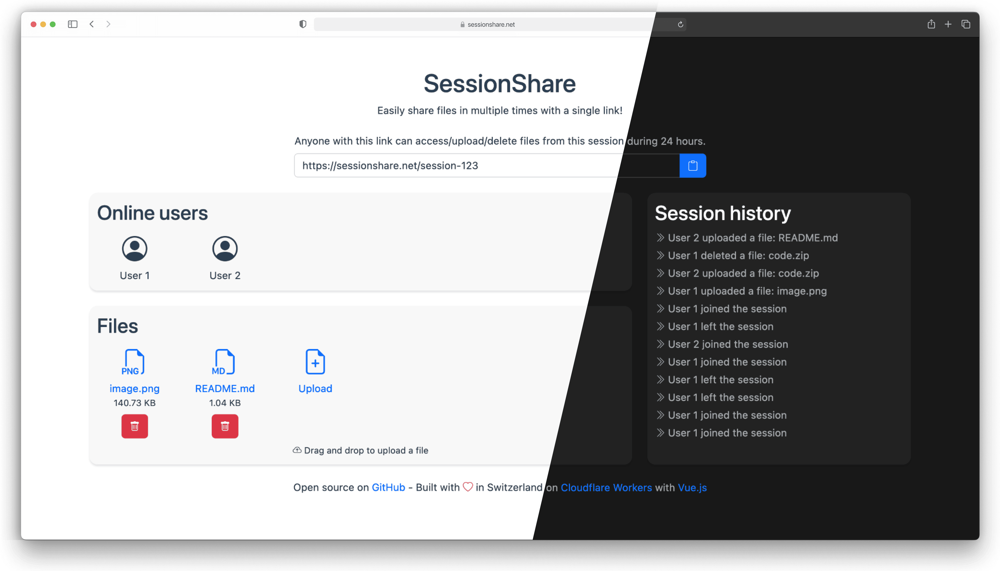

# SessionShare

Easily share files in multiple times with a single link!

Built using [Vue.js](https://vuejs.org/) on [Cloudflare Workers](https://workers.cloudflare.com/), with Durable Objects,
R2 and Cloudflare Pages. Also supports end-to-end files encryption (using AES-256-GCM).

This project was made for the [Cloudflare Developer Challenge 2022](https://challenge.developers.cloudflare.com/) and
was selected as one of the winners 🎉⚡️

## Why ?

When working with several people, it is often necessary to send files to each other. There are many services to send a
single file, but I haven't found one that allows you to send several files in several times without having to send a new
link each time.

## Features

* Use a single link to share multiple files in multiples times
* End-to-end AES-256-GCM files encryption support
* Blazing fast thanks to Cloudflare Workers
* Uploaded/deleted files are instantly visible by everyone in the session

## Planned features

* Support for larger files using multipart upload (currently limited to 100 MB)
